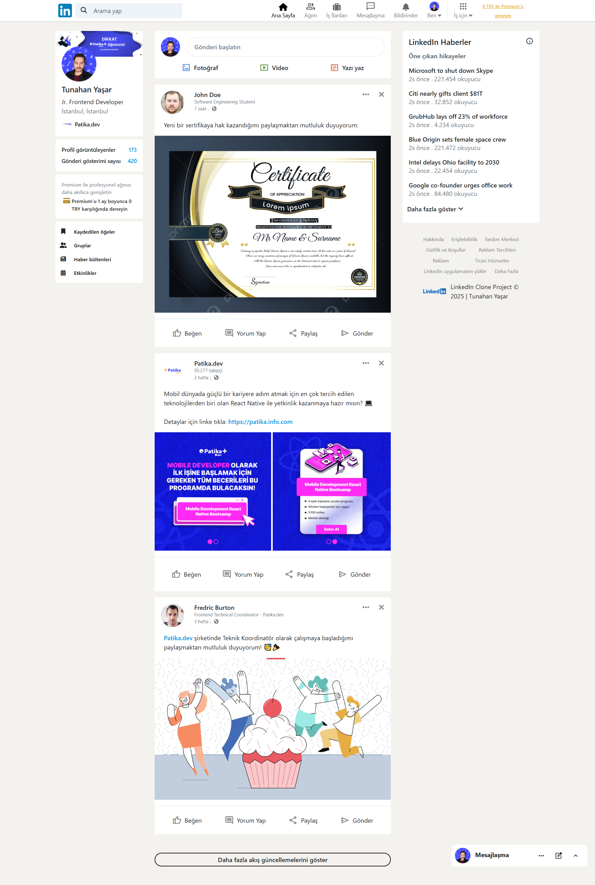
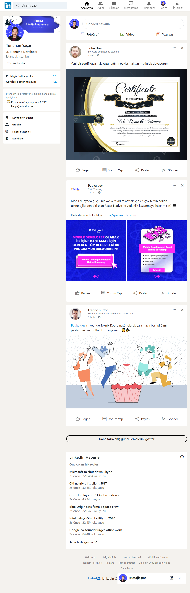
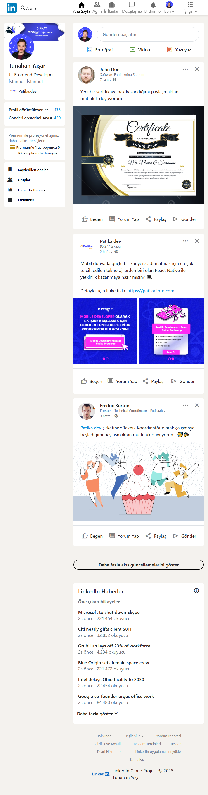
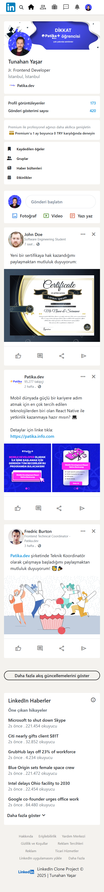

# :link::blue_square: Bootstrap Clone Projesi | Linkedin

[🇬🇧 İngilizce README için tıklayın](./README.md)

*Oluşturulma Tarihi: 3 Mart 2025*

* Bu proje, Patika Frontend Bootcamp'i için oluşturulan **Hafta-3 / Ödev-3 / Linkedin Clone** projesidir.
* **HTML**, **CSS** ve **Bootstrap 4** ile responsive tasarım alıştırması için geliştirilmiştir.
* Proje, LinkedIn anasayfa düzenini; header, sol/sağ aside, ana içerik ve sabit chat bölümüyle taklit eder.

---

## 🌐 Canlı Demo

Canlı web sitesini ziyaret edin: [LinkedIn Clone - Bootstrap](https://linkedin-clone-bootstrap.vercel.app/)

---

## :computer: Kurulum ve Kullanım

1. Projeyi klonlayın:
```bash
git clone https://github.com/tunahanyasar/linkedin-clone-bootstrap.git
```
2. Proje dizinine gidin:
```bash
cd linkedin-clone-bootstrap
```
3. `index.html` dosyasını bir web tarayıcısında açın.

---

## 📜 Sayfa Yapısı

:open_file_folder: **Klasörler;**
* `index.html` - Ana sayfa
* `style.css` - Özel stil dosyası
* `img/` - Proje görselleri
* `img-page/` - README için ekran görüntüleri

### Ana Bileşenler
- **Header:** Logo, arama çubuğu, navigasyon ikonları (sabit)
- **Sol Aside:** Profil kartı ve kullanıcı bilgileri
- **Ana İçerik:** Gönderi oluşturma kartı ve kullanıcı paylaşımları
- **Sağ Aside:** Haberler ve footer linkleri
- **Sabit Chat:** Sağ altta sabit chat bölümü

---

## :star2: Öne Çıkan Özellikler

- Tüm ekran boyutları için tamamen responsive tasarım
- Sabit header ve chat bölümü
- Sticky aside ve footer
- Bootstrap 4 grid sistemi
- FontAwesome ve Google Material Symbols entegrasyonu
- Kullanıcı görselleri için randomuser.me kullanımı

---

## 💡 Kullanılan Teknolojiler

**Frontend:**
* HTML5
* CSS3 (Flexbox, Grid, Pseudo-classes, Hover)
* Bootstrap 4
* FontAwesome
* Google Material Symbols

---

## 🎯 Proje Hedefleri

1. **Kullanıcı Deneyimi**
   - Gerçekçi LinkedIn anasayfa navigasyonu ve düzeni
   - Responsive ve erişilebilir tasarım
2. **Teknik Başarılar**
   - Bootstrap grid, sticky ve fixed konumlandırmanın etkin kullanımı
   - Modern CSS teknikleriyle düzen ve etkileşim

---

## 📸 Ekran Görüntüleri

### Tam Sayfa


### Orta Ekran


### Küçük Ekran


### Çok Küçük Ekran


---

## 📞 İletişim

[Tunahan Yaşar](https://github.com/tunahanyasar)

* GitHub: [@tunahanyasar](https://github.com/tunahanyasar)
* LinkedIn: [Tunahan Yaşar](https://www.linkedin.com/in/tunahan-yasar/) 